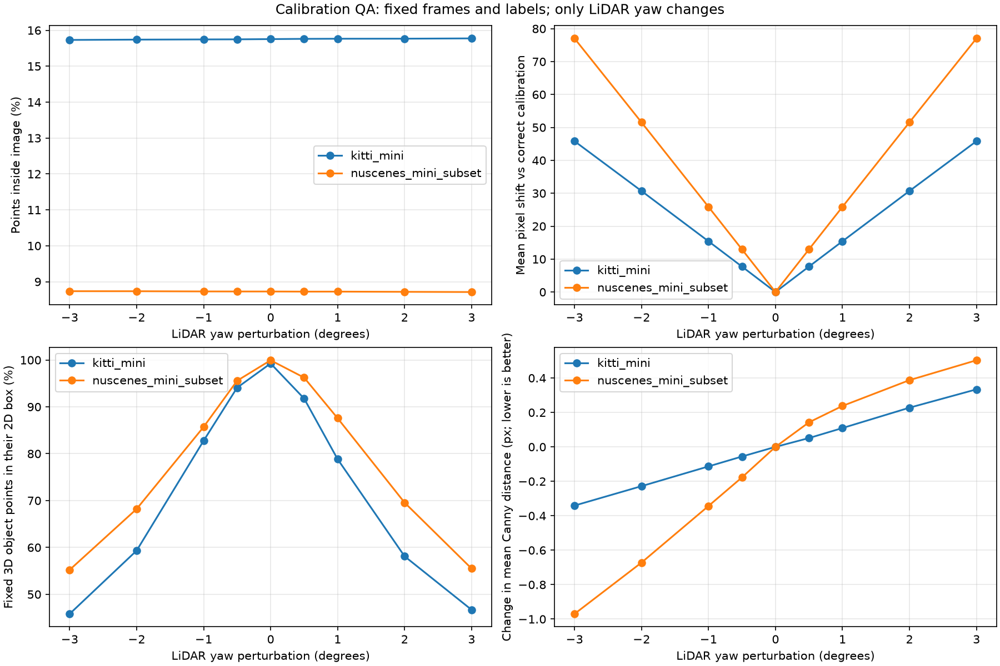
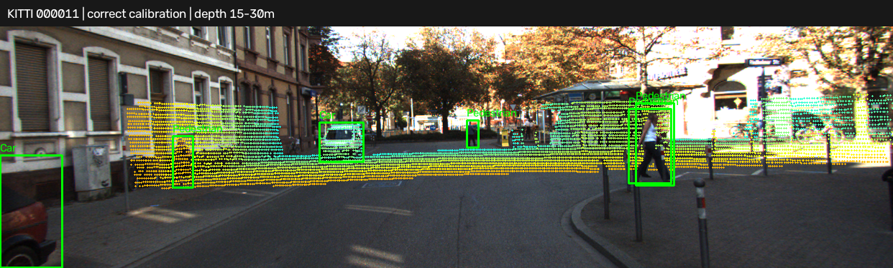
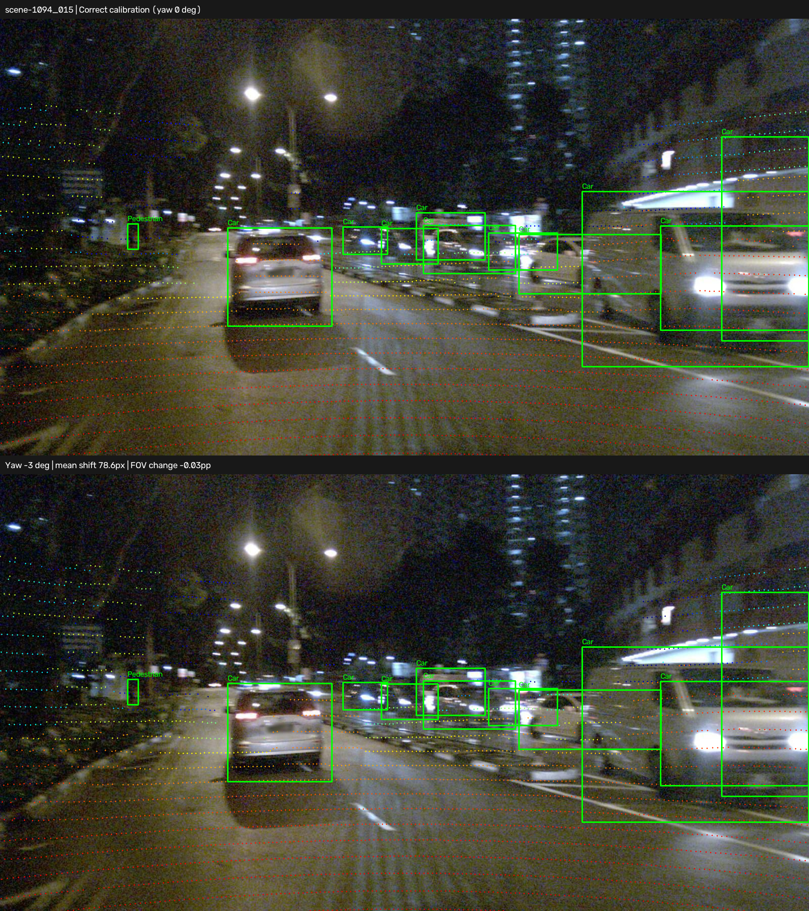

# Báo cáo Day 6: Độ nhạy phép chiếu LiDAR–camera với lệch yaw

- **Họ tên:** Phạm Văn Kiên
- **MSSV:** 2A202602590
- **Link repo:** https://github.com/pvksssss/K4-Track4-Day06-PhamVanKien-2A202602590--3D-From-Point-Clouds
- **Topic:** A — LiDAR-camera projection QA
- **Dataset:** data/synthetic, data/kitti_mini, data/nuscenes_mini_subset
- **Các frame đã dùng:** toàn bộ 20 frame KITTI và 80 keyframe nuScenes (scene-0103_000…039, scene-1094_000…039); danh sách đầy đủ trong `results/yaw_perturb_sweep.csv`. Synthetic 000000…000004 dùng kiểm tra sức khỏe dữ liệu.

## 1. Claim

Trên tập con đã chạy, yaw +1° làm điểm LiDAR dịch trung bình **15,42 px trên KITTI** và **25,88 px trên nuScenes**, nhưng tỷ lệ điểm trong ảnh chỉ đổi lần lượt **+0,0101 và −0,0032 điểm phần trăm**. Vì vậy tỷ lệ inside-FOV đơn lẻ không đủ phát hiện calibration drift. Đây là thí nghiệm có calibration gốc làm tham chiếu, không phải bộ tự hiệu chuẩn hay đo độ chính xác detector.

## 2. Evidence

Chạy **100 frame × 9 mức yaw**: −3°, −2°, −1°, −0,5°, 0°, +0,5°, +1°, +2°, +3°. Giữ nguyên điểm, ảnh, nhãn, intrinsic và bù ego-motion nuScenes; chỉ ghép rotation quanh z của LiDAR vào extrinsic. Không dùng ngẫu nhiên nên không cần seed. Bảng dưới là trung bình không trọng số theo frame; đầy đủ trong [CSV tổng hợp](../results/yaw_summary.csv), [CSV từng frame](../results/yaw_perturb_sweep.csv) và [CSV từng object](../results/yaw_object_metrics.csv).

| Dataset | Yaw | Trong ảnh (%) | Dịch pixel trung bình | Điểm object còn trong box 2D (%) |
|---|---:|---:|---:|---:|
| KITTI | 0° | 15,7543 | 0,00 | 99,26 |
| KITTI | +0,5° | 15,7612 | 7,73 | 91,78 |
| KITTI | +1° | 15,7645 | 15,42 | 78,84 |
| KITTI | +2° | 15,7661 | 30,69 | 58,11 |
| KITTI | +3° | 15,7740 | 45,82 | 46,70 |
| nuScenes | 0° | 8,7269 | 0,00 | 99,94 |
| nuScenes | +0,5° | 8,7236 | 12,96 | 96,24 |
| nuScenes | +1° | 8,7237 | 25,88 | 87,58 |
| nuScenes | +2° | 8,7179 | 51,56 | 69,57 |
| nuScenes | +3° | 8,7120 | 77,05 | 55,50 |

Pixel shift so cùng ID điểm còn nhìn thấy ở cả hai cấu hình; CSV ghi cả tỷ lệ mất điểm baseline để tránh che giấu điểm rơi khỏi ảnh. Với mỗi object, lấy điểm trong box 3D GT và trong ảnh ở yaw 0° làm mẫu số cố định; đếm điểm còn nằm trong đúng box 2D của object đó sau perturb (điểm ra ngoài ảnh tính là trượt). nuScenes có box 2D do loader chiếu box 3D tạo ra, **không phải annotation 2D độc lập**, nên retention chủ yếu kiểm tra tính nhất quán hình học, không chứng minh chất lượng nhãn ảnh.



Demo KITTI cùng frame 000011 ở ba dải **z-camera**: [0–15 m](../results/figures/demo_near.png), [15–30 m](../results/figures/demo_mid.png), [30–80 m](../results/figures/demo_far.png); xanh lá là box GT, điểm màu theo depth (gần đỏ, xa xanh). Có thêm [yaw +3°](../results/figures/demo_kitti_yaw_3deg.png), [nuScenes ban ngày](../results/figures/demo_scene-0103.png) và [ban đêm](../results/figures/demo_scene-1094.png).



Khác biệt giữa hai dataset có thể đến từ intrinsic/độ phân giải ảnh, bố trí cảm biến, số beam và nội dung cảnh; nuScenes còn có ngày/đêm và thời điểm chụp hai sensor khác nhau. Với phép quay nhỏ, pixel shift phụ thuộc focal length theo pixel và hướng tia; không thể kết luận sensor nào tốt hơn chỉ từ bảng này. Chưa tách từng yếu tố để xác định quan hệ nhân quả.

## 3. Failure case

Frame **scene-1094_015, yaw −3°**: shift trung bình **78,65 px**, p95 **91,97 px**, nhưng inside-FOV chỉ giảm **8,1290% → 8,1031%** (−0,0259 điểm phần trăm). Cảnh báo minh họa `|ΔFOV| ≥ 1 điểm phần trăm` sẽ bỏ sót; ngưỡng này chưa được huấn luyện hay kiểm định độc lập. Retention object giảm **100,00% → 71,55%**. Case được chọn tự động là shift lớn nhất trong các case `|yaw| ≥ 1°` có `|ΔFOV| < 1` trên chính tập thí nghiệm.



Lỗi gốc thuộc **Geometry**, còn việc metric bỏ sót thuộc **Metric**: điểm dịch bên trong khung ảnh, điểm ra ngoài có thể được bù bởi điểm mới đi vào. Mean distance tới Canny trên cùng ID điểm còn giảm **38,54 → 38,43 px** dù calibration sai; cạnh đường, đèn, texture và điểm mặt đường không tạo correspondence ngữ nghĩa đáng tin. Số chi tiết trong [failure_case.json](../results/failure_case.json). Do đó cả FOV lẫn Canny toàn ảnh đều cần được đối chiếu bằng ROI/object và nhiều frame.

## 4. Khuyến nghị nếu triển khai thật

Ch?a ho?n th?nh checkpoint t??ng ?ng.

## 5. Cách chạy lại

Chạy từ thư mục gốc trên Windows PowerShell; môi trường đã dùng Python 3.14.5, CPU, không cần GPU. Phiên bản thư viện cố định ở `requirements-lock.txt`, cấu hình ở [experiment_metadata.json](../results/experiment_metadata.json). Không chỉnh sửa dữ liệu gốc.

```powershell
python -m venv .venv
.\.venv\Scripts\python.exe -m pip install -r requirements-lock.txt
.\.venv\Scripts\python.exe tools/verify_data.py --data-root data/kitti_mini
.\.venv\Scripts\python.exe tools/verify_data.py --data-root data/nuscenes_mini_subset
.\.venv\Scripts\python.exe -m unittest src.test_projection -v
.\.venv\Scripts\python.exe -m starter.data_health --data-root data/synthetic --out results/data_health_synthetic.csv
.\.venv\Scripts\python.exe -m src.calibration_qa
.\.venv\Scripts\python.exe tools/check_submission.py
```

`python -m src.calibration_qa --help` liệt kê tham số; có thể dùng `--frame-limit 2 --out-dir results_quick` để chạy nhanh. Hai lần chạy đầy đủ được so checksum ba CSV benchmark để kiểm tra tính tái lập. Nguồn ảnh/dữ liệu: **KITTI Vision Benchmark Suite** và **nuScenes (Motional)**.

## 6. Khai báo sử dụng AI

Ch?a ho?n th?nh checkpoint t??ng ?ng.

